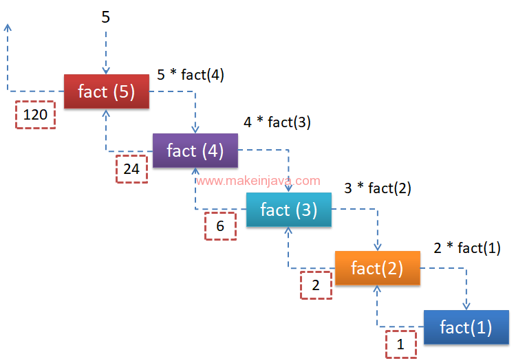

# 递归函数详解


## 什么是函数
一个较大的程序一般应分为若干个程序块，每一个模块用来实现一个特定的功能。所有的高级语言中都有子程序这个概念，用子程序实现模块的功能。在C语言中，子程序的作用是由一个主函数和若干个函数构成。由主函数调用其他函数，其他函数也可以互相调用。同一个函数可以被一个或多个函数调用任意多次。<br/>
在程序设计中，常将一些常用的功能模块编写成函数，放在函数库中供公共选用。要善于利用函数，以减少重复编写程序段的工作量。

## 函数的调用及返回
注意，我们的函数底层使用的是数据结构中的栈实现，每次函数调用其实就是一个压入栈的过程，当函数运行结束后，会返回到上一个函数中(主调函数),这个过程我们称之为弹栈。比如说函数A调用函数B，那么程序的控制权由函数 `A` 传递给函数 `B`, 当函数 `B` 运行结束后，会从 函数 `B` 返回到函数 `A`, 下面演示了这个过程。

调用过程
``` bash
操作系统 -> 主函数main() -> A() -> B() -> C() -> D()
```
返回过程
``` bash
操作系统 <- 主函数main() <- A() <- B() <- C() <- D()
```

一句话总结就是,函数从哪儿调用，就会返回到哪儿。(从哪儿来，回哪儿去)，不过值得注意的是: 当函数返回的时候，可以携带结果返回，返回给主调函数。

请看下面这个例子。
<details>
<summary>函数调用及返回过程</summary>

``` c
# include <stdio.h>

void A(); /* 函数声明 */

void B();

void C();

void D();

void A() {
    printf("函数A()被调用了\n");
    B();
    printf("函数A()调用结束了\n");
}

void B() {
    printf("函数B()被调用了\n");
    C();
    printf("函数B()调用结束了\n");
}

void C() {
    printf("函数C()被调用了\n");
    D();
    printf("函数C()调用结束了\n");
}

void D() {
    printf("函数D()被调用了\n");
    /* do something */
    printf("函数D()调用结束了\n");
}

int main() {
    A();
    return 0;
}

```
输出结果如下:
```
主函数main()被调用了
函数A()被调用了
函数B()被调用了
函数C()被调用了
函数D()被调用了
函数D()调用结束了
函数C()调用结束了
函数B()调用结束了
函数A()调用结束了
主函数main()调用结束了
```
</details>

有了上面的函数基础，我们来看一下什么是递归函数。

## [什么是递归函数](https://zh.wikipedia.org/wiki/%E9%80%92%E5%BD%92)
> 递归（英语：Recursion），又译为递回，在数学与计算机科学中，是指在函数的定义中使用函数自身的方法。递归一词还较常用于描述以自相似方法重复事物的过程。例如，当两面镜子相互之间近似平行时，镜中嵌套的图像是以无限递归的形式出现的。也可以理解为自我复制的过程

举个例子

<details>
<summary>和尚讲故事</summary>
从前有座山，山里有座庙，庙里有个老和尚，正在给小和尚讲故事呢！故事是什么呢？“从前有座山，山里有座庙，庙里有个老和尚，正在给小和尚讲故事呢！故事是什么呢？‘从前有座山，山里有座庙，庙里有个老和尚，正在给小和尚讲故事呢！故事是什么呢？……’”
</details>


## 代码案例

* 递归实现 5的阶乘 (`5!=5*4*3*2*1`),其递归过程如下

    分析: 5的阶乘 (`5!`) = `5*4*3*2*1` = `5*(4*3*2*1)` = `5*4!`
    
    调用过程如下
    ```
    5! = 5*4!
    4! = 4*3!
    3! = 3*2!
    2! = 2*1!
    1! = 1*0!
    0! = 1      # 递归出口
    ```
    可以发现，为了解决5的阶乘 (`5!`),我们必须先解决 `4!`，而解决 `4!` 依赖于 `3!`，于是就有了下面的关系
    
    ```
    5! 依赖 4!
    4! 依赖 3!
    3! 依赖 2!
    2! 依赖 1!
    1! 依赖 0!  # 0!不需要依赖，因为这是一个最简单的子问题，可以直接得到结果。
    ```
    当最小的子问题得到解决后，会逐层返回。
    
    如果我们使用 `fact(n)` 表示 n 的阶乘 (n!)，那么 5 的阶乘可以表示为 `fact(5)`, 4 的阶乘可以表示为 `fact(4)`, 同理 0 的阶乘可以表示为 `fact(0)` ,则 5的阶乘 `fact(5)`的调用过程如下: 

    ```
    fact(5) = 5 * fact(4)
    fact(4) = 4 * fact(3)
    fact(3) = 3 * fact(2)
    fact(2) = 2 * fact(1)
    fact(1) = 1 * fact(0)
    fact(0) = 0     # 递归出口
    ```

    调用过程关系图如下  
    ```
    5 * fact(4) -> 4 * fact(3) -> 3 * fact(2) -> 2 * fact(1) -> 1 * fact(0)
    ```
    返回过程如下
    ```
     5 * fact(4) <- 4 * fact(3) <- 3 * fact(2) <- 2 * fact(1) <- 1 * fact(0)
    ```

    要编写一个函数，我们必须要知道如下确定递归的两个条件

    * 递归结束条件

        本案例中递归结束条件是: `n == 0`
    * 递归的调用公式

        本案例中递归的公式是: `fact(n) = n * fact(n - 1)`

    图解过程

    


    <details>
    <summary>递归求解5的阶乘源代码</summary>

    ``` c
    # include <stdio.h>

    /**
     * 计算 n 的阶乘
     */
    int fact(int n) {
        if (n == 0) {
            return 1;
        } else {
            return n * fact(n - 1);
        }

        /* 简洁的写法 */
        /* return n == 0 ?: n * fact(n - 1); */
    }

    int main() {

        /* 打印 3 的阶乘 */
        printf("3的阶乘 = %d\n", fact(3));

        /* 打印 5 的阶乘 */
        printf("5的阶乘 = %d\n", fact(5));

        /* 打印 1 - 10 的阶乘*/
        for (int i = 1; i <= 10; ++i) {
            printf("%d的阶乘 = %d\n", i, fact(i));
        }
        return 0;
    }

    ```
    </details>

* 递归实现 (`1+2+3+...+100`)

    分析:定义递归函数 `sum(n)` 表示 `1-n` 的和，则 `sum(100)` = `1+2+3+...+100`, 同理 `sum(99)` = `1+2+3+...+99`，
    
    因为 `1+2+3+...+99+100 = (1+2+3+...+99) + 100`，所以
    `sum(100)` = `sum(99) + 100`

    调用过程如下
    ```
    sum(100) = sum(99) + 100
    sum(99) = sum(98) + 99
    sum(98) = sum(97) + 98
    ...
    ...
    sum(2) = sum(1) + 2
    sum(1) = sum(0) + 1
    sum(0) = 0
    ``` 

    * 递归结束条件: `n == 0`，即 `sum(0)` 返回 `0`
    * 递归调用公式: `sum(n) = sum(n - 1) + n`

    <details>
    <summary>递归求前n项目和源代码</summary>

    ``` c
    # include <stdio.h>

    /**
     * 计算1 + 2 + 3 + ... + n
     */
    int sum(int n) {
        if (n == 0) {
            return 0;
        } else {
            return sum(n - 1) + n;
        }

        /* 简洁的写法 */
        //return n == 0 ?: sum(n - 1) + n;
    }

    int main() {

        printf("1+2+3+...+100 = %d\n", sum(100));
        return 0;
    }
    ```
    </details>

* 递归打印[斐波拉契数列](https://zh.wikipedia.org/wiki/%E6%96%90%E6%B3%A2%E9%82%A3%E5%A5%91%E6%95%B0%E5%88%97)前 20 项

    斐波拉契数列如下
    `1, 1, 2, 3, 5, 8, 13, 21, 34, 55, 89, 144, 233...`

    <details>
    <summary>源代码</summary>

    ``` c
    # include <stdio.h>

    /**
     * 求出斐波拉契第 n 项
     */
    int fib(int n) {
        if (n == 1 || n == 2) {
            return 1;
        } else {
            return fib(n - 1) + fib(n - 2);
        }

        /* 简洁的写法 */
        //return n == 0 || n == 1 ?: fib(n - 1) + fib(n - 2);
    }

    int main() {

        /* 打印斐波拉契第2项 */
        printf("斐波拉契第2项: %d\n", fib(2));

        /* 打印斐波拉契第3项 */
        printf("斐波拉契第5项: %d\n", fib(5));

        /* 打印斐波拉契前20项，5项换一行*/
        for (int i = 1; i <= 20; ++i) {
            printf("%d\t", fib(i));
            if (i % 5 == 0) {
                printf("\n");
            }
        }
        return 0;
    }

    ```
    </details>
* 递归实现汉诺塔

    * [ ] TODO

## 递归和循环对比
* 递归速度慢,消耗内存高，循环速度快，消耗内存低
* 无限递归会导致系统崩溃，而无限循环会消耗 `CPU` 周期
* 递归使代码更小巧，而迭代使代码更长。