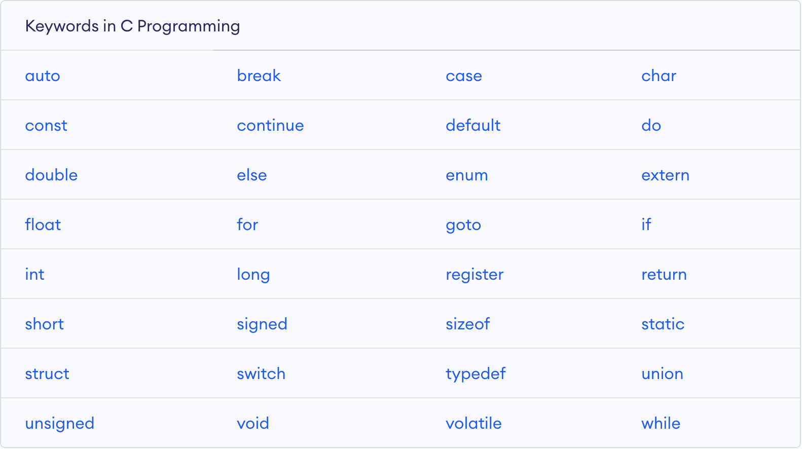

## 变量的声明及关键词
简单的说变量就是内存中某段内存地址对应的空间别名，可以通过引入变量名的方式读取内存中的数据(或者写入数据到内存中)。

变量名命名必须遵循以下规则
* 变量名可以包含字母，数字，下划线
* 变量名只能够以字母或者下划线开头，不能够以数字开头
* 变量名之间不能存在空格
* 变量名不能够是C语言保留词或者关键词，如`goto`，`int`等


### [关键词](https://www.programiz.com/c-programming/list-all-keywords-c-language)
C语言中提供了很多的保留词，我们称之为关键词，关键词被赋予特殊的含义。常见的关键词如下。


* `char` 英文单词character的缩写，表示字符数据类型
* `int` 英文单词integer的缩写， 表示整型数据类型
* `float` 表示单精度浮点数
* `long` 英文`long int`的缩写。范围比`int`大
* `double` 表示双进度浮点数

### 声明变量
变量的声明告诉编译器变量应该分配多大空间存储数据，变量的声明格式如下。

* 仅定义未赋初始值，如果变量未赋值，变量所对应的内存单元数据值为随机值。
    ``` c
    数据类型 变量名;
    ```
    ``` c
    char sex; 
    int age;
    float price;
    long factorial;
    double radius;
    ```

* 声明的变量的同时赋初始值。
    ``` c
    数据类型 变量名 = 初始值;
    ```
    ``` c
    char sex = 'M';
    int age = 24;
    float price = 22.22F;
    long factorial = 100L;
    double area = 3.14 * 5 * 5;
    ```

* 可以一行同时定义多个变量，使用逗号(`,`)分隔。
    ``` c
    int i = 1, count = 0, sum = 0;
    ```


### 代码规范
* 变量和值之间尽量加入一个空白字符进行缩减，这样可以可以使代码的可读性增强。如<br/>
    ``` c
    int sum=0;
    int i=1,count=0;
    ```
    应该改为如下代码规范
    ``` c
    int sum = 0;
    int i = 1, count = 0;
    ```
* 变量最好定义的同时赋值，以免后续忘记赋值导致程序异常。
